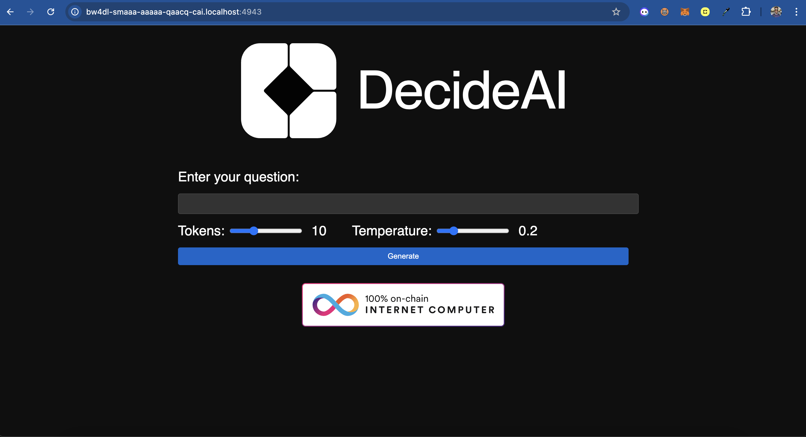

# DecideAI: GPT-2 on the Internet Computer
ICP Supports on chain inference of small models. This example takes you through how to run a GPT-2 model on chain on ICP. 

This is an open source repository for the [DecideAI project](https://github.com/decide-ai/decide-ai-ic/)

## Getting Started: 

1. Clone the repository:
```bash
git clone https://github.com/decide-ai/decide-ai-ic 

cd examples/gpt2
``` 

2. Install the dependencies:

```bash
# File uploader for IC
cargo install ic-file-uploader 

# Add support for the WebAssembly System Interface (WASI) target to your Rust toolchain
rustup target add wasm32-wasi 

# Add wasi2ic tool, which is needed to convert the WASI-compiled Wasm to IC-compatible Wasm
cargo install wasi2ic
``` 

3. Deploy the canister:
```bash
dfx deploy model       
``` 

4. Setup the model: 
The project uses the GPT-2 Open Instruct v1 model. Download the following files from Hugging Face. 
- model.safetensors
- config.json
- tokenizer.json

You can find them here: [https://huggingface.co/vicgalle/gpt2-open-instruct-v1/tree/main](https://huggingface.co/vicgalle/gpt2-open-instruct-v1/tree/main)

Once you've downloaded them, move them into the ``examples/gpt2/src/model`` directory.  

5. Upload the model files:

```bash
# Upload model.safetensors and load it
ic-file-uploader model append_safetensors_bytes ./src/model/model.safetensors 
dfx canister call model store_safetensors_bytes_to_stable
dfx canister call model load_safetensors_bytes_from_stable

# Upload config.json and set it up
ic-file-uploader model append_config_bytes ./src/model/config.json    
dfx canister call model setup_model 

# Upload tokenizer.json and set it up
ic-file-uploader model append_tokenizer_bytes ./src/model/tokenizer.json
dfx canister call model store_tokenizer_bytes_to_stable
dfx canister call model load_tokenizer_bytes_from_stable
dfx canister call model setup_tokenizer
``` 

6. You can now interact with the model directly from your terminal:

- Direct token inference:
```bash
dfx canister call model inference '(vec {1; 2}, 1:nat8, 0.2:float64)'
``` 

Parameters:
  - Input token sequence
  - Generation length (nat8)
  - Sampling temperature (float64)

- Text generation:
```bash 
dfx canister call model generate '("What is the capital of Kenya?", 10:nat8, 0.2:float64)'
``` 

7. Running the frontend: 

Ensure you're using Node 21.0.0 or higher.

```bash
# Move to the frontend directory
cd src/frontend 

# Install dependencies
npm install 

# Deploy the frontend
dfx deploy frontend 
``` 

This is what you'll see 

And just like that, you've got a GPT-2 model running on the Internet Computer! 


